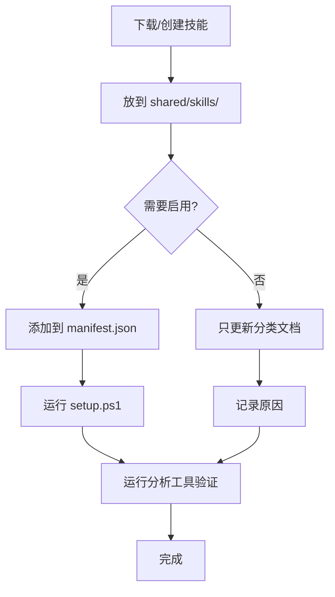

# 🎯 技能管理系统

> 帮助你轻松管理和组织所有 Agent 技能

## 🚀 快速开始

### 我想知道有哪些技能可用

```powershell
node scripts\analyze-skills.js
```

### 我想查看技能分类

```powershell
Get-Content SKILLS_CATALOG.md
```

### 我想启用/禁用某个技能

```powershell
notepad clients\claude\skills.manifest.json
.\setup.ps1 -Mode Copy
```

---

## 📚 文档导航

根据你的需求，选择合适的文档：

| 文档 | 适用场景 | 阅读时间 |
|------|----------|----------|
| [**快速参考**](SKILLS_QUICK_REFERENCE.md) | 快速查命令和状态 | 2 分钟 |
| [**完整目录**](SKILLS_CATALOG.md) | 查看所有技能分类 | 5 分钟 |
| [**管理指南**](docs/SKILLS_MANAGEMENT.md) | 深入了解管理方法 | 10 分钟 |
| [**命令参考**](COMMANDS.md) | 查找所有命令 | - |

---

## 🎯 核心概念

### 三层管理结构

```
┌─────────────────────────────────────────┐
│  📖 分类文档 (SKILLS_CATALOG.md)      │  ← 人工维护
│     完整的技能分类和说明                 │
└─────────────────────────────────────────┘
                  ↓
┌─────────────────────────────────────────┐
│  🔍 分析工具 (analyze-skills.js)       │  ← 自动分析
│     检测分类、依赖、状态                 │
└─────────────────────────────────────────┘
                  ↓
┌─────────────────────────────────────────┐
│  📝 配置文件 (skills.manifest.json)    │  ← 控制启用
│     决定哪些技能实际加载                 │
└─────────────────────────────────────────┘
```

### 技能分类系统

- 🎯 **Matt Pocock 核心** (14) - 高质量独立工具
- ⚡ **Superpowers 工作流** (7) - 完整流程系统 [已禁用]
- 🤝 **Multica 协作** (5) - 多代理协作
- 🎨 **设计与原型** (2) - 前端相关
- 🛠️ **工具与元技能** (3) - 管理技能
- 🔧 **其他独立** (3) - 独立功能

---

## 🛠️ 工具介绍

### 📊 分析工具

**位置：** `scripts/analyze-skills.js`

**用途：** 自动扫描和分析所有技能

**功能：**
- ✅ 统计技能数量
- ✅ 自动分类
- ✅ 识别 Superpowers
- ✅ 检测依赖关系
- ✅ 显示启用状态

**示例输出：**
```
╔═══════════════════════════════════════════════════════════╗
║           技能分析报告 - Skills Analysis Report          ║
╚═══════════════════════════════════════════════════════════╝

📊 总技能数: 34

📁 分类统计:
  🎯 Matt Pocock 核心: 14
  ⚡ Superpowers 工作流: 7
  🤝 Multica 协作: 5
  ...
```

---

## 📖 典型场景

### 场景 1: 我下载了很多技能，不知道哪个是哪个

```powershell
# 运行分析工具
node scripts\analyze-skills.js

# 查看详细分类
Get-Content SKILLS_CATALOG.md
```

### 场景 2: 我想禁用 Superpowers 工作流

```powershell
# 查看哪些是 Superpowers 技能
node scripts\analyze-skills.js

# 编辑配置移除这些技能
notepad clients\claude\skills.manifest.json

# 同步
.\setup.ps1 -Mode Copy
```

### 场景 3: 我想了解某个技能的详细信息

```powershell
# 查看技能原始文档
Get-Content shared\skills\grill-me\SKILL.md

# 在分类文档中查找
Get-Content SKILLS_CATALOG.md | Select-String "grill-me"
```

### 场景 4: 我添加了新技能，想归类

```powershell
# 1. 放到 shared/skills/ 目录

# 2. 运行分析看自动分类结果
node scripts\analyze-skills.js

# 3. 手动更新分类文档
notepad SKILLS_CATALOG.md

# 4. 如果要启用，添加到配置
notepad clients\claude\skills.manifest.json

# 5. 同步
.\setup.ps1 -Mode Copy
```

---

## ✨ 为什么需要这个系统？

### 问题
- ❌ 技能文件夹混乱，不知道哪个技能干什么
- ❌ 不清楚技能之间的关系和依赖
- ❌ 不知道哪些技能已启用
- ❌ 修改配置后不确定是否生效

### 解决方案
- ✅ **分类文档** - 清晰的组织结构
- ✅ **分析工具** - 自动检测和报告
- ✅ **配置管理** - 集中控制启用状态
- ✅ **最佳实践** - 明确的管理指南

---

## 📝 配置文件格式

**位置：** `clients/{client}/skills.manifest.json`

**格式：**
```json
{
  "skills": [
    "skill-name-1",
    "skill-name-2",
    "skill-name-3"
  ]
}
```

**规则：**
- ✅ 列表中的技能会被启用
- ✅ 未列出的技能会被禁用（但文件保留）
- ✅ 三个客户端（claude/codex/openCode）可以有不同配置

---

## 🔄 完整工作流



---

## 🎓 学习路径

1. **入门** (5分钟)
   - 阅读本文
   - 运行 `node scripts\analyze-skills.js`
   - 查看 `SKILLS_QUICK_REFERENCE.md`

2. **熟悉** (15分钟)
   - 阅读 `SKILLS_CATALOG.md`
   - 练习启用/禁用技能
   - 了解各分类的用途

3. **精通** (30分钟)
   - 阅读 `docs/SKILLS_MANAGEMENT.md`
   - 了解依赖关系
   - 掌握最佳实践

---

## 🔗 相关资源

- 🎯 [快速参考卡](SKILLS_QUICK_REFERENCE.md)
- 📖 [完整分类目录](SKILLS_CATALOG.md)
- 📚 [详细管理指南](docs/SKILLS_MANAGEMENT.md)
- 🔧 [所有命令](COMMANDS.md)
- 💡 [核心规则](shared/rules/core.md)

---

## ❓ 常见问题

### Q: 为什么不直接删除不用的技能？
A: 保留文件便于将来重新启用，用配置控制更灵活。

### Q: 分析工具的分类准确吗？
A: 基于文件路径和引用关系的启发式分类，大部分准确，可手动调整。

### Q: 如何确认修改生效？
A: 运行 `.\scripts\doctor.ps1 -RepoRoot .` 检查同步状态。

### Q: 可以为不同客户端配置不同技能吗？
A: 可以！每个客户端有独立的 `skills.manifest.json`。

---

## 🤝 贡献

发现新的技能分类或改进建议？

1. 更新相关文档
2. 运行分析工具验证
3. 提交变更

---

**开始管理你的技能吧！** 🚀

运行第一个命令：
```powershell
node scripts\analyze-skills.js
```
